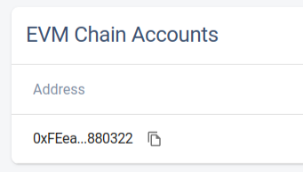
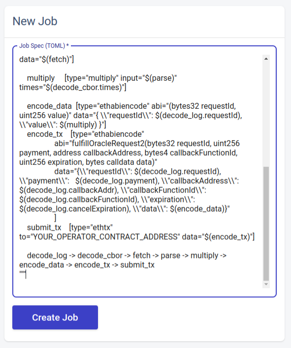

Chainlink price oracle for development
---

Chainlink oracle implementation with a local deploying on Ganache Ethereum chain

## Project structure
- `truffle/`: This folder holds truffle project
  - `contracts/`: This folder holds solidity smart contracts
  - `migrations/`: This folder holds migration scripts which deploys “LinkToken”, “Operator” and “Client” contracts to the local blockchain
  - `scripts/`: This folder holds scripts for communicate with contracts
- `chainlink/` and `postgress/`: These folders hold config to start chainlink node
- `config/`: This folder holds generated data after deploying contracts

## Prepare oracle
1. Prepare test Ethereum network
   - start a Ganache workspace that includes [truffle-config.js](truffle/truffle-config.js) from this project
2. Migrate contracts
    ```shell
    cd truffle/ && truffle migrate --network ganache
    ```
3. Run [Chainlink Node](https://docs.chain.link/chainlink-nodes/v1/running-a-chainlink-node)
   - e.g. [docker-compose.yaml](docker-compose.yaml)
4. Open http://localhost:6688/keys 
   - Сopy the keys at the bottom of the page 
    
   
   - Paste them into the file [nodes.env](config/nodes.env)
5. Set up a node
   - Register node
   ```shell
   truffle exec scripts/1-register.js --network ganache
   ```
   - Generate job  
   ```shell
    truffle exec scripts/2-prep-job-def.js --network ganache
    ```
   - Create job in http://localhost:6688/jobs
   - Paste config from [job-definition.toml](config/job-definition.toml) to Job Spec
    
   -  Paste Job ID from note to [job-id.env](config/job-id.env)

## Interacting with the Oracle
- Run to request the current Dollar price in Rubles
```shell
truffle exec scripts/3-request.js --network ganache
```
- Run to get the result of a request
```shell
truffle exec scripts/get-price.js --network ganache
```
